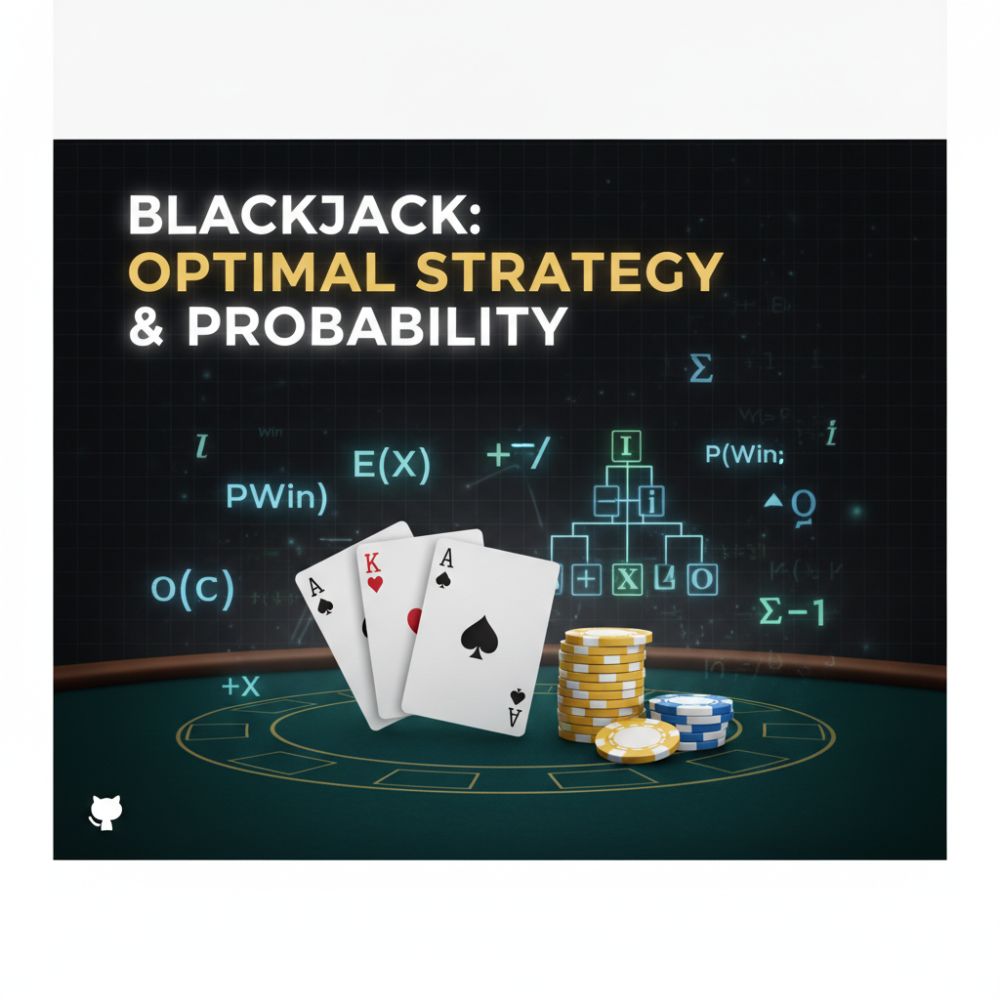

<p align="center">
  
</p>

# Blackjack Research Simulator

A Python-based Blackjack research simulator focused on card counting, player knowledge modeling, Monte Carlo EV estimation, and strategy analysis.

This project is not just a basic Blackjack game. It is designed as a simulation and research platform for studying how different strategy components behave under realistic shoe conditions, including hidden dealer hole-card uncertainty, cut-card penetration, Hi-Lo counting, True Count estimation, and Monte Carlo-based decision evaluation.

> Educational and simulation research project only.
> This project is not gambling advice and not intended for real-money gambling use.

---

## Project Status

Current version: **v1.0**

The first version includes a working terminal-based Blackjack simulator with:

- Multi-deck shoe simulation
- Dealer hole-card hidden state modeling
- Player knowledge vs real game state separation
- Hi-Lo card counting
- Running Count and True Count
- Shoe penetration tracking
- Cut-card simulation
- Monte Carlo EV decision engine
- Basic strategy support
- Illustrious 18 deviations
- Simplified split support
- Real Advantage Meter
- Bet multiplier suggestion
- Real-time terminal UI
- Session statistics
- Dealt cards log

The project is designed to grow into a full Blackjack strategy research platform.

---

## Core Concept

A key idea of the simulator is separating:

**Real Game State** from **Player Knowledge State**.

In a real Blackjack game, the dealer's hole card has already been removed from the shoe, but the player does not know what it is.

This simulator models that correctly.

Visible cards are tracked as known cards, while hidden cards remain unknown until revealed.

Monte Carlo simulations therefore use a realistic unknown-card pool instead of omniscient knowledge.

---

## Current Features

### Multi‑Deck Shoe

The simulator models a real blackjack shoe with multiple decks.

Tracked values include:

- Remaining cards
- Dealt cards
- Known visible cards
- Hidden unknown cards
- Decks remaining
- Penetration

---

### Hidden Dealer Hole Card

The dealer receives:

- one visible upcard
- one hidden hole card

The hole card is removed from the shoe but hidden from the player until the dealer turn.

This hidden card is still included in the unknown card pool used by Monte Carlo simulations.

---

### Known / Hidden / Unknown Card Model

The deck separates cards into different information layers:

**known_cards**  
Cards visible to the player.

Examples:

- player cards
- dealer upcard
- revealed cards

**hidden_cards**  
Cards removed from the shoe but not visible.

Example:

- dealer hole card

**unknown_cards**  
Cards the player cannot identify.

```
unknown_cards = remaining_shoe + hidden_cards
```

Monte Carlo simulation draws from this pool.

---

### Hi‑Lo Card Counting

The simulator implements the classic Hi‑Lo counting system.

```
2–6  -> +1
7–9  -> 0
10–A -> -1
```

Running Count is calculated from known visible cards.

---

### True Count

True Count normalizes the Running Count based on decks remaining.

Formula:

```
True Count = Running Count / Decks Remaining
```

True Count is used by the decision engine and advantage meter.

---

### Shoe Penetration

The simulator tracks how deep into the shoe the game currently is.

Higher penetration makes card counting signals stronger.

---

### Cut Card Simulation

The simulator supports a cut‑card point.

When the cut card is reached, the simulator can request a shuffle after the current round.

---

### Basic Strategy Engine

A built‑in basic strategy engine evaluates the player's hand versus the dealer upcard and suggests actions such as:

```
HIT
STAND
DOUBLE
SPLIT
```

---

### Illustrious 18 Deviations

The simulator includes support for well‑known card counting deviations commonly referred to as the Illustrious 18.

These deviations adjust basic strategy decisions based on the True Count.

---

### Monte Carlo EV Engine

The simulator estimates expected value of actions using Monte Carlo simulation.

Possible actions evaluated:

```
hit
stand
double
```

For each action the engine estimates:

- EV
- win rate
- lose rate
- push rate
- dealer bust probability
- player bust probability

---

### Hybrid Decision Engine

The final decision combines multiple signals:

- basic strategy
- shoe composition
- illustrious deviations
- Monte Carlo EV
- bust probability
- dealer bust probability

Output includes:

- final move
- reason
- estimated player edge
- estimated house edge
- EV comparison
- confidence

---

### Real Advantage Meter

The simulator estimates whether the current shoe favors the player or the house.

Example states:

```
House Advantage
Neutral
Player Advantage
Strong Player Advantage
```

---

### Bet Multiplier Suggestion

Based on estimated player edge the simulator suggests a bet multiplier.

Example:

```
Player Edge: +1.1%
Suggested Bet: 2x
```

---

### Simplified Split Support

Version 1 contains simplified split logic.

When splitting:

- each new hand receives one card
- split hands stand immediately

Full split play will be added in later versions.

---

### Real‑Time Terminal UI

The simulator provides a live terminal display showing:

- shoe state
- running count
- true count
- advantage meter
- player hands
- dealer hand
- decision engine output
- session statistics
- dealt card log

---

## Project Structure

```
blackjack-research-simulator/

README.md
requirements.txt

main.py

deck.py
game.py
models.py
strategy.py
ui.py
```

---

## Installation

Clone the repository:

```
git clone https://github.com/YOUR_USERNAME/blackjack-research-simulator.git
cd blackjack-research-simulator
```

Create virtual environment:

```
python -m venv venv
```

Activate environment.

Install dependencies:

```
pip install -r requirements.txt
```

Run simulator:

```
python main.py
```

---

## Current Limitations

Version 1 focuses on building the simulation foundation.

Current limitations:

- simplified split implementation
- rule configuration not yet available
- surrender not implemented
- insurance not implemented
- manual card input not implemented
- reinforcement learning not implemented

These will be added in future versions.

---

## Roadmap

### v1.1 — Rule Engine

Planned features:

- Dealer hits / stands on soft 17
- Blackjack payout 3:2 or 6:5
- Double after split
- Resplit pairs
- Resplit aces
- Late surrender
- Insurance
- Rule configuration system

---

### v1.2 — Manual Card Input Mode

Users will be able to enter a specific blackjack situation.

Example:

```
Player: A,7
Dealer: 9
True Count: +3
Decks Remaining: 2.5
```

Output:

```
Best Move: STAND
EV Hit: -0.18
EV Stand: +0.04
Confidence: 76%
```

---

### v1.3 — Training Mode

Interactive blackjack training system.

Features:

- basic strategy drills
- deviation drills
- EV explanation
- mistake tracking
- accuracy statistics

---

### v2.0 — Reinforcement Learning Strategy

Research into discovering blackjack strategies using machine learning.

Possible algorithms:

- Q‑Learning
- Monte Carlo Control
- SARSA
- Deep Q Network

State examples:

```
player_total
soft_or_hard
pair
true_count_bucket
dealer_upcard
```

Actions:

```
hit
stand
double
split
surrender
```

---

### v2.5 — Bankroll Simulation

Planned features:

- bankroll tracking
- risk of ruin
- Kelly criterion
- bet spread optimization
- session EV simulation

---

## Disclaimer

This project is for educational, mathematical, and simulation research purposes only.

It is not gambling advice.

It should not be used for real‑money casino play.

---

## Support Development

If you find this project useful and want to support continued development, you can donate.

TRX Wallet:

```
TG6yyH3JRA7zEqQ8aUvvzhRwRAS4k6z7hv
```

Support helps continue development of:

- manual card input
- training mode
- reinforcement learning experiments
- bankroll simulation

---

## License

MIT License

---

## Author

GitHub: https://github.com/yasin-pro

